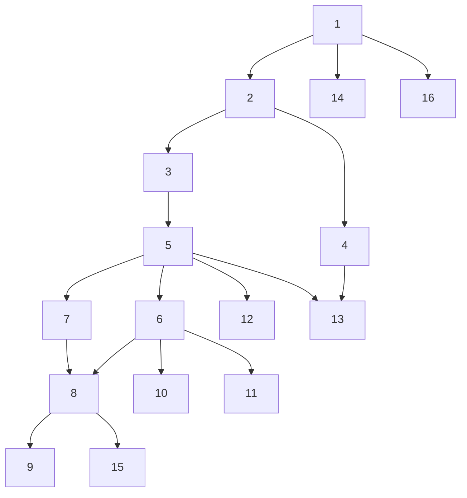

# Artificial Intelligence and Machine Learning Course

This repository provides an overview of a comprehensive course designed for PhD students from non-technical backgrounds. The course offers a broad introduction to Artificial Intelligence (AI) and Machine Learning (ML), covering essential concepts, methodologies, and practical applications.

In addition to theoretical content, this repository also includes Python code implementations for many of the discussed models and algorithms. This will allow you to see how these concepts are applied in practice, helping to bridge the gap between theory and implementation.

### Course Outline

1. Introduction and Definitions
2. Data
3. Data Preprocessing and Feature Engineering
4. Big Data Technologies
5. Machine Learning Basics
6. Machine Learning Models
7. Machine Learning Types
8. Machine Learning Tasks
9. Machine Learning Algorithm Families
10. Advanced Machine Learning Models
11. Deep Learning
12. Reinforcement Learning
13. Time Series Analysis in Machine Learning
14. Machine Learning Applications
15. Model Deployment and Monitoring
16. AI in Industry
17. Explainable AI (XAI)
18. Ethics and Fairness in AI

### Order of chapters:
In case you don't want to follow the order of topics/chapters, I highly recommend considering the dependency among topics as shown below:

